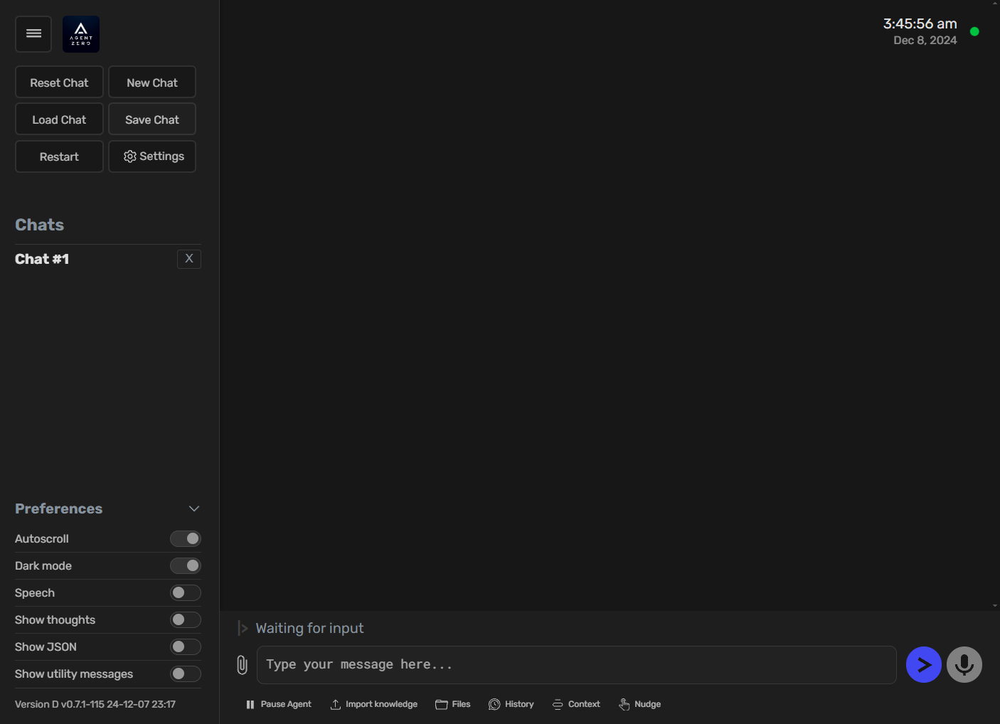
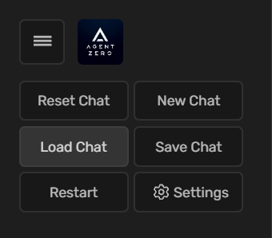
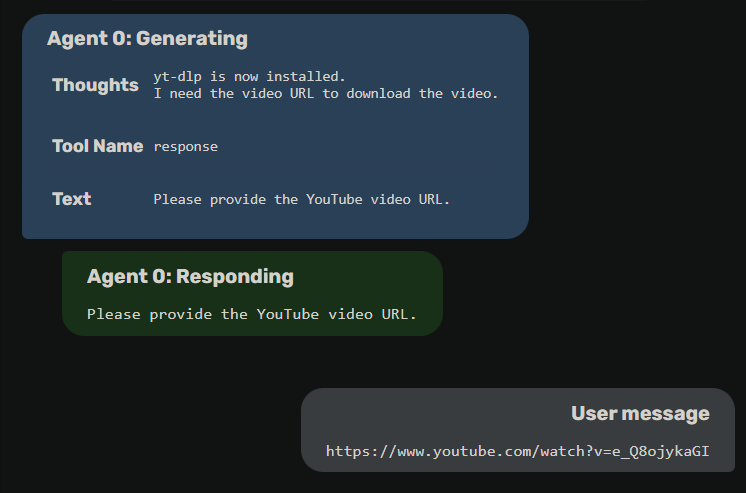

# Quick Start
This guide provides a quick introduction to using Agent Flux. We'll cover launching the web UI, starting a new chat, and running a simple task.

## Launching the Web UI
1. Make sure you have Agent Flux installed and your environment set up correctly (refer to the [Installation guide](installation.md) if needed).
2. Open a terminal in the Agent Flux directory and activate your conda environment (if you're using one).
3. Run the following command:

```bash
python run_ui.py
```

4.  A message similar to this will appear in your terminal, indicating the Web UI is running:


5. Open your web browser and navigate to the URL shown in the terminal (usually `http://127.0.0.1:50001`). You should see the Agent Flux Web UI.



> [!TIP]
> As you can see, the Web UI has four distinct buttons for easy chat management: 
> `New Chat`, `Reset Chat`, `Save Chat`, and `Load Chat`.
> Chats can be saved and loaded individually in `json` format and are stored in the
> `/tmp/chats` directory.

    

## Running a Simple Task
Let's ask Agent Flux to download a YouTube video. Here's how:

1.  Type "Download a YouTube video for me" in the chat input field and press Enter or click the send button.

2. Agent Flux will process your request.  You'll see its "thoughts" and the actions it takes displayed in the UI. It will find a default already existing solution, that implies using the `code_execution_tool` to run a simple Python script to perform the task.

3. The agent will then ask you for the URL of the YouTube video you want to download.

## Example Interaction
Here's an example of what you might see in the Web UI at step 3:


## Next Steps
Now that you've run a simple task, you can experiment with more complex requests. Try asking Agent Flux to:

* Perform calculations
* Search the web for information
* Execute shell commands
* Explore web development tasks
* Create or modify files

The [Usage Guide](usage.md) provides more in-depth information on using Agent Flux's various features, including prompt engineering, tool usage, and multi-agent cooperation.